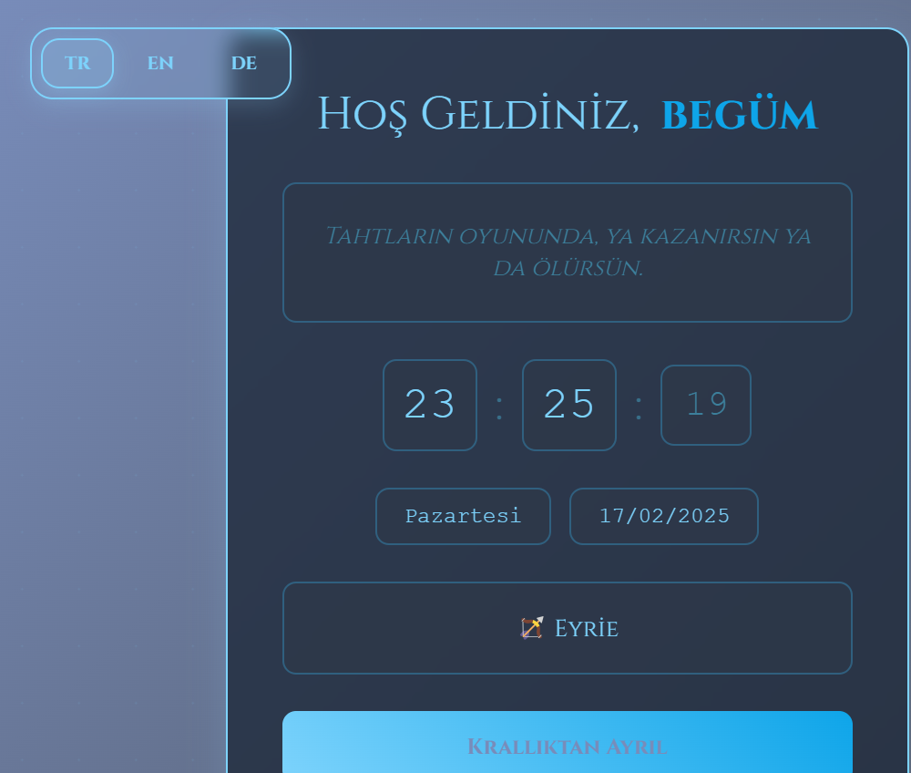
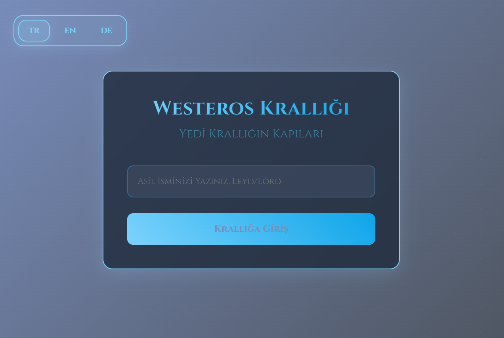

# Westeros Krallığı Giriş Deneyimi

Game of Thrones temalı, çok dilli bir giriş ekranı deneyimi. Kullanıcılar kendi isimlerini girerek krallığa giriş yapabilir, farklı dillerde içerikleri görüntüleyebilir ve Game of Thrones tema müziği eşliğinde benzersiz bir deneyim yaşayabilirler.

 

## Özellikler

- 🌍 Çoklu dil desteği (Türkçe, İngilizce, Almanca)
- ⌚ Canlı saat gösterimi (saat:dakika:saniye)
- 📅 Güncel tarih gösterimi
- 🎵 Game of Thrones tema müziği
- 🎮 Ses kontrolü (açma/kapama ve ses seviyesi ayarı)
- 💫 Dinamik hover efektleri
- 📱 Responsive tasarım

## Teknolojiler

- HTML5
- CSS3
- JavaScript (ES6+)
- Lucide Icons
- Google Fonts (Cinzel)
- Animate.css

## Kurulum

1. Repoyu klonlayın:
```bash
git clone https://github.com/kullaniciadi/westeros-kingdom.git
```

2. Proje dizinine gidin:
```bash
cd westeros-kingdom
```

3. Gerekli dosyaların mevcut olduğundan emin olun:
   - index.html
   - WesterosKingdom.js
   - got-theme.mp3

4. Projeyi bir web sunucusunda çalıştırın (örneğin Live Server)

## Kullanım

1. Giriş ekranında isminizi girin
2. "Krallığa Giriş" butonuna tıklayın veya Enter tuşuna basın
3. Sağ üst köşedeki ses kontrolünden müziği açıp kapatabilir ve ses seviyesini ayarlayabilirsiniz
4. Sol üst köşedeki dil seçeneklerinden istediğiniz dili seçebilirsiniz
5. Çıkış yapmak için "Krallıktan Ayrıl" butonunu kullanın

## Özelleştirme

### Yeni Dil Ekleme

`WesterosKingdom.js` dosyasındaki `translations` objesine yeni bir dil ekleyebilirsiniz:

```javascript
translations: {
    yeni_dil: {
        title: "Başlık",
        subtitle: "Alt Başlık",
        // ... diğer çeviriler
    }
}
```

### Alıntı Ekleme

`translations` objesindeki ilgili dilin `quotes` dizisine yeni alıntılar ekleyebilirsiniz:

```javascript
quotes: [
    "Yeni alıntı...",
    // ... diğer alıntılar
]
```

## Katkıda Bulunma

1. Bu repoyu fork edin
2. Yeni bir branch oluşturun (`git checkout -b feature/yeniOzellik`)
3. Değişikliklerinizi commit edin (`git commit -am 'Yeni özellik eklendi'`)
4. Branch'inizi push edin (`git push origin feature/yeniOzellik`)
5. Pull Request oluşturun

## Lisans

Bu proje MIT lisansı altında lisanslanmıştır. Daha fazla bilgi için `LICENSE` dosyasına bakın.

## İletişim

Ad Soyad - begum.doganay@icloud.com

Proje Linki: [https://github.com/begumdoganay/westeros-kingdom](https://github.com/begumdoganay/westeros-kingdom)

## Teşekkürler

- [Game of Thrones](https://www.hbo.com/game-of-thrones) - Tema ve ilham kaynağı
- [Lucide Icons](https://lucide.dev/) - İkonlar
- [Google Fonts](https://fonts.google.com/) - Cinzel fontu
- [Animate.css](https://animate.style/) - Animasyonlar